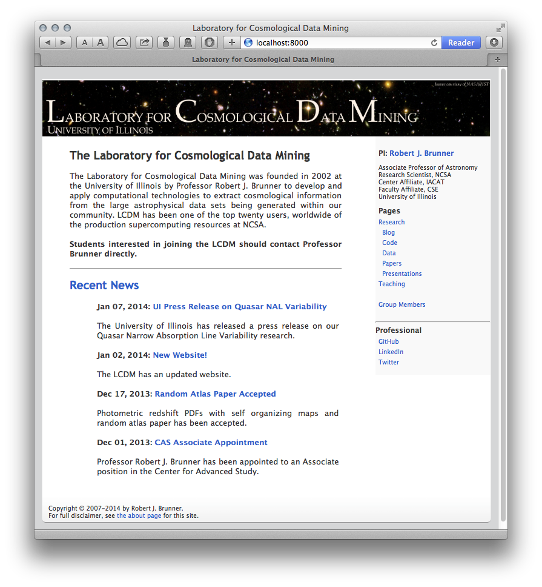

lcdm-pelican
============

This is a custom pelican theme originally developed by Robert J. Brunner
for the [Laboratory for Cosmological Data
Mining](http://lcdm.astro.illinois.edu) at the University of Illinois.
The theme has a clickable image header, a sidebar with static
information and list of links, and a common footer.

Key points include:
- Heirarchical page sturcture.
- Output has multiple page directories (handled by using Save_as tag).
- Custom template for listing collection of pages by category
- Custom template for listing homepage that mixes static and dynamic content.

Note: Currently all pages reside in the page directory, and all page
save locations and URLs are handled via the Save_as tag, which is
mandatory for all pages. Ideally, Pelican would support multiple page
directories, but to implement this would require a modification to
Pelican to accept and use a tuple (or list) of directories instead of a
single directory in the PAGE_DIR attribute in the peliconconf.py file.
Doing this involves a non-trivial (at least for me) re-write of the
Pelican software package.
